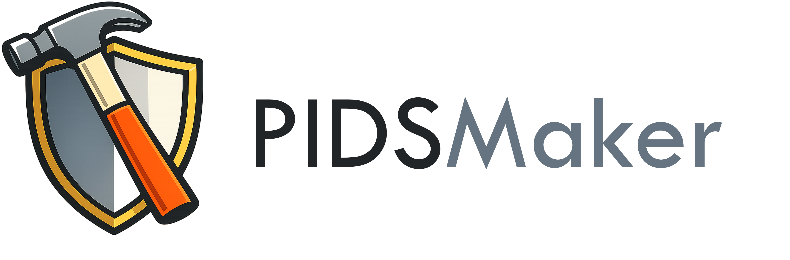
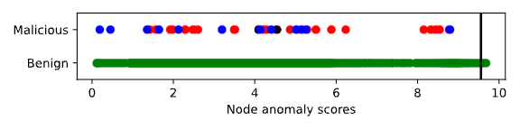

<p align="center">
  <br><br>

  <a href="https://ubc-provenance.github.io/PIDSMaker/">
    
  </a>
  <a href="https://doi.org/10.5281/zenodo.15603122">
    
  </a>
  
  </a>
  <a href="https://github.com/ubc-provenance/PIDSMaker/releases">
    
  </a>
   <a href="https://github.com/ubc-provenance/PIDSMaker/stargazers">
    
  </a>
</p>

---

<p align="center">
  <strong>
    <a href="https://www.usenix.org/conference/usenixsecurity25/presentation/bilot">📄 Paper</a>
    &nbsp;|&nbsp;
    <a href="https://ubc-provenance.github.io/PIDSMaker/">📘 Documentation</a>
    &nbsp;|&nbsp;
    <a href="https://ubc-provenance.github.io/PIDSMaker/ten-minute-install/">⚙️ Installation</a>
  </strong>
</p>

The first framework designed to build and experiment with provenance-based intrusion detection systems (PIDSs) using deep learning architectures.
It provides a single codebase to run most recent state-of-the-arts systems and easily customize them to develop new variants.

**Currently supported PIDSs**:
- **Velox** (USENIX Sec'25): [Sometimes Simpler is Better: A Comprehensive Analysis of State-of-the-Art Provenance-Based Intrusion Detection Systems](https://tfjmp.org/publications/2025-usenixsec-2.pdf)
- **Orthrus** (USENIX Sec'25): [ORTHRUS: Achieving High Quality of Attribution in Provenance-based Intrusion Detection Systems](https://www.usenix.org/system/files/conference/usenixsecurity25/sec25cycle1-prepub-103-jiang-baoxiang.pdf)
- **R-Caid** (IEEE S\&P'24): [R-CAID: Embedding Root Cause Analysis within Provenance-based Intrusion Detection](https://gangw.web.illinois.edu/rcaid-sp24.pdf)
- **Flash** (IEEE S\&P'24): [Flash: A Comprehensive Approach to Intrusion Detection via Provenance Graph Representation Learning](https://dartlab.org/assets/pdf/flash.pdf)
- **Kairos** (IEEE S\&P'24): [Kairos: Practical Intrusion Detection and Investigation using Whole-system Provenance](https://arxiv.org/pdf/2308.05034)
- **Magic** (USENIX Sec'24): [MAGIC: Detecting Advanced Persistent Threats via Masked Graph Representation Learning](https://www.usenix.org/system/files/usenixsecurity24-jia-zian.pdf)
- **NodLink** (NDSS'24): [NODLINK: An Online System for Fine-Grained APT Attack Detection and Investigation](https://arxiv.org/pdf/2311.02331)
- **ThreaTrace** (IEEE TIFS'22): [THREATRACE: Detecting and Tracing Host-Based Threats in Node Level Through Provenance Graph Learning](https://arxiv.org/pdf/2111.04333)

## 📄 Documentation

A [comprehensive documentation](https://ubc-provenance.github.io/PIDSMaker/) is available, explaining all possible arguments and providing examples on how integrating new systems.


## Setup

### ⬇️ Clone the repo
```
git clone https://github.com/ubc-provenance/PIDSMaker.git
```

### 💻 Installation with Docker

We have made the installation of PIDSMaker inclusing pre-processed databases for DARPA TC and OpTC datasets easy and fast. Simply follow [these guidelines](https://ubc-provenance.github.io/PIDSMaker/ten-minute-install/).

## 🧪 Basic usage of the framework

Once you have a followed the installation guidelines, you can open a shell in the `pids container` and experiment in multiple ways.

- Replace `SYSTEM` by `velox | orthrus | nodlink | threatrace | kairos | rcaid | flash | magic`.
- Replace `DATASET` by `CLEARSCOPE_E3 | CADETS_E3 | THEIA_E3 | CLEARSCOPE_E5 | THEIA_E5 | optc_h201 | optc_h501 | optc_h051`.

1. Run in the shell:
    ```shell
    python pidsmaker/main.py SYSTEM DATASET
    ```

2. Run in the shell, monitored to weights & biases (W&B):
    ```shell
    python pidsmaker/main.py SYSTEM DATASET --wandb
    ```

3. Run in background, monitored to W&B (recommended for multiple parallel runs and for research):
    ```shell
    ./run.sh SYSTEM DATASET
    ```

You can still watch the logs in your shell using `tail -f nohup.out`.

We generally using using W&B for experiment monitoring and historization (see installation guidelines). 

**Warning:** Before performing evaluations, you should tune all systems (see docs [here](https://ubc-provenance.github.io/PIDSMaker/features/tuning/)).

## Reproducing results

As explained in SC5 of [Bilot et al.](https://www.usenix.org/system/files/usenixsecurity25-bilot.pdf), PIDSs exhibit significant instability—that is, high sensitivity to training perturbations—due to their self-supervised training nature. 
Running the same configuration with different random seeds or minor hyperparameter changes often yields substantially different results. 
Consequently, reproducing results as the framework evolves presents a real challenge.

Based on our experiments, we provide [tuned hyperparameters](tuned_systems.md) for the main systems.

We recommend [running each system multiple times](https://ubc-provenance.github.io/PIDSMaker/features/instability/) to increase the likelihood of obtaining a run with good metrics. Alternatively, you can perform [hyperparameter tuning](https://ubc-provenance.github.io/PIDSMaker/features/tuning/) for each system.

## Customize existing systems

The default configuration files in `config/*.yml` represent the architecture of existing PIDSs in YAML format. They contain the original hyperparameters used by each system. 

The main strength of PIDSMaker is the customization of existing systems for easy experimentation. 
A few examples below.

### From CLI

<i>Running Kairos with embedding size of 128 instead of 100, and last neighbor sampling set to last 10 neighbors instead of 20.</i>

```shell
python pidsmaker/main.py kairos CADETS_E3 \
  --training.node_hid_dim=128 \
  --batching.intra_graph_batching.tgn_last_neighbor.tgn_neighbor_size=10
```

<i>Running Orthrus with Doc2vec instead of word2vec, and 3 GraphSAGE layers instead of 2 attention layers.</i>

```shell
python pidsmaker/main.py orthrus CADETS_E3 \
  --featurization.used_method=doc2vec \
  --featurization.emb_dim=128 \
  --training.encoder.used_methods=tgn,sage \
  --training.encoder.sage.num_layers=3
```

### From a new YAML config file

Want to create a new PIDS? Create a new config under `config/your_system.yml`, inherit from existing PIDSs and tune it as you want.

<i>Magic with node type prediction instead of its hybrid masked feature reconstruction and structure prediction objective function, and use a 2-layer MLP with ReLU as decoder, and use NodLink's thresholding method.</i>

``` yaml
_include_yml: magic

training:
  decoder:
    used_methods: predict_node_type
    predict_node_type:
      node_mlp:
        architecture_str: linear(0.5) | relu

evaluation:
  node_evaluation:
    threshold_method: nodlink
```

### Visualization

You can then visualize the results using the many generated figures, locally or on Weights and Biases.



## Hyperparameter tuning

PIDSMaker supports easy hyperparameter tuning for existing or new models. 
Follow the [instructions](https://ubc-provenance.github.io/PIDSMaker/features/tuning/) available in our documentation.

You can specify the range of hyperparameters to search in a yaml config.

```yaml
method: grid 

parameters:
  training.lr:
    values: [0.001, 0.0001]
  training.node_hid_dim:
    values: [32, 64, 128, 256]
  featurization.used_method:
    values: [fasttext, word2vec]
```

Then run the framework in tuning mode.

```sh
./run.sh my_system CADETS_E3 --tuning_mode=hyperparameters
```

Once you find the best hyperparameters, store them in a yaml file and run your tuned model.

```sh
./run.sh my_system CADETS_E3 --tuned
```

## Citation

If you use this work, please cite the following paper:
```
@inproceedings{bilot2025simpler,
	title={{Sometimes Simpler is Better: A Comprehensive Analysis of State-of-the-Art Provenance-Based Intrusion Detection Systems}},
	author={Bilot, Tristan and Jiang, Baoxiang and  Li, Zefeng and  El Madhoun, Nour and Al Agha, Khaldoun and Zouaoui, Anis and Pasquier, Thomas},
	booktitle={Security Symposium (USENIX Sec'25)},
	year={2025},
	organization={USENIX}
}
```

## Contributing

Pull requests are welcome! Please follow the [contribution guidelines](https://ubc-provenance.github.io/PIDSMaker/contributing/).

## License

See [licence](LICENSE).
