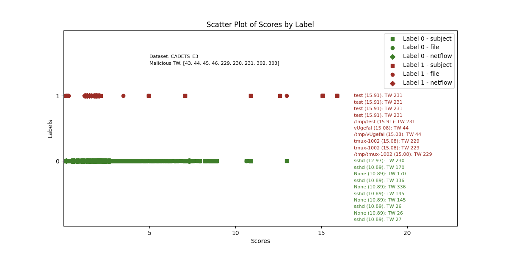
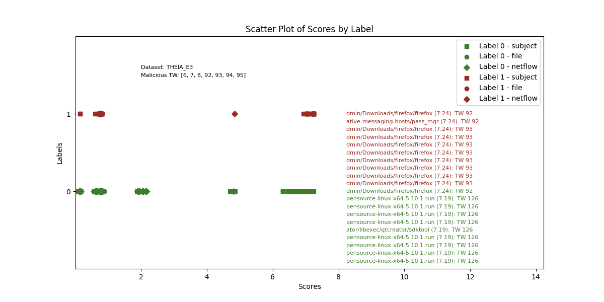
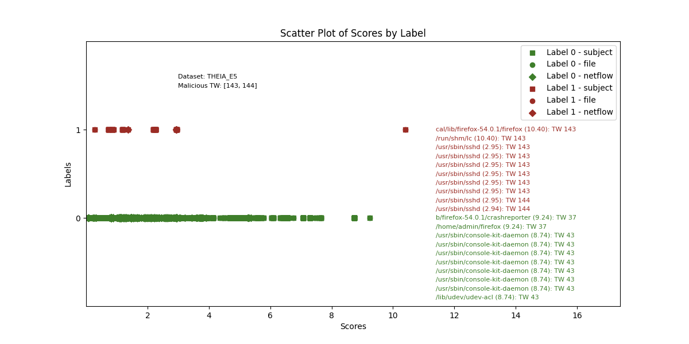
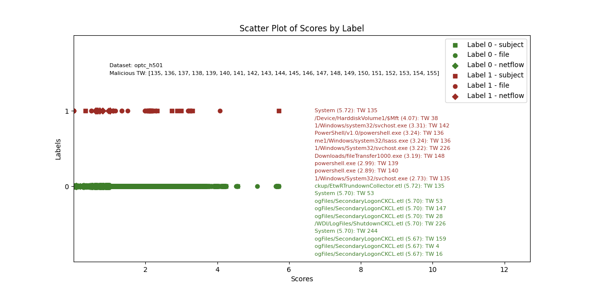
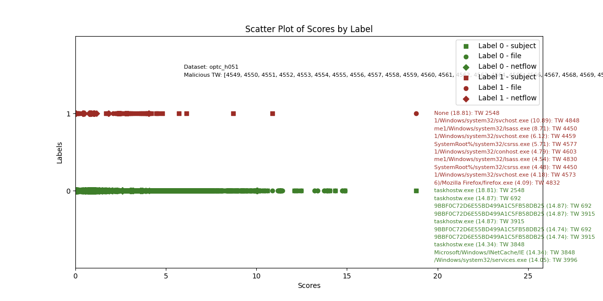
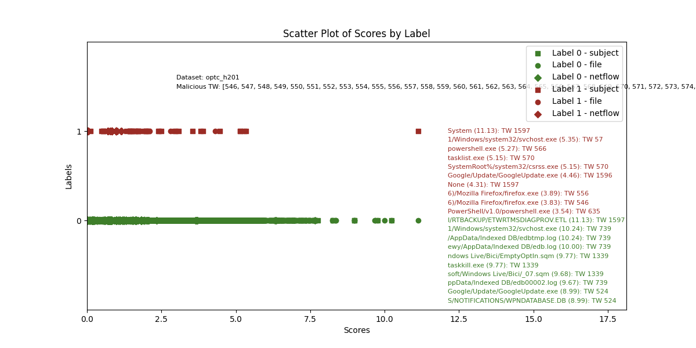

[](https://doi.org/10.5281/zenodo.15603122)

# Sometimes Simpler is Better: A Comprehensive Analysis of State-of-the-Art Provenance-Based Intrusion Detection Systems

This repo contains the original code of the paper.

> [!IMPORTANT]
> For a practical usage of the framework, we recommend using the last version of PIDSMaker, available on the [main branch](https://github.com/ubc-provenance/PIDSMaker).

## Setup

### Clone the repo
```
git clone https://github.com/ubc-provenance/PIDSMaker.git -b velox velox
cd velox
```

### 10-min install of Docker and Datasets

We have made the installation of DARPA TC/OpTC easy and fast, simply follow [these guidelines](settings/ten-minute-install.md).

## Reaching max ADP with Velox

We provide weights to achieve the max ADP scores (i.e. best-case detection of all attacks) with Velox. 

#### 1. Download weights
In the pids container, run:

```shell
pip install gdown
cd weights

# Neural net encoder weights
gdown https://drive.google.com/drive/folders/13M4e-suqr_y2hnFIwyFlZ7zrXjlyKevA --folder

# Word2vec weights
gdown https://drive.google.com/drive/folders/1qO_nQWivT44RnEv_wcwjO8fWz5lGuZCd --folder
```

#### 2. Run experiments

```shell
cd scripts
```

```shell
./run_local.sh velox CADETS_E3 --tuned --from_weights
./run_local.sh velox THEIA_E3 --tuned --from_weights
./run_local.sh velox THEIA_E5 --tuned --from_weights
./run_local.sh velox CLEARSCOPE_E5 --tuned --from_weights
./run_local.sh velox optc_h201 --tuned --from_weights
./run_local.sh velox optc_h501 --tuned --from_weights
./run_local.sh velox optc_h051 --tuned --from_weights
```

**Note**: We do not recommend using the `CLEARSCOPE_E3` dataset as we found that all netflow nodes are null.
Overall, this dataset contains redundant events and is of poor quality.

### Expected results

Due to instability, results may be different from the paper.

| Name             | ADP |
|------------------|-----|
| CADETS_E3        |   1.00  |
| THEIA_E3         | 0.93|
| THEIA_E5         | 1.00    |
| CLEARSCOPE_E5    |   0.49  |
| optc_h501        |   1.00  |
| optc_h051        |   1.00  |
| optc_h201        |  1.00   |

We show that the simple architecture of Velox is enough to attribute the maximum anomaly score to at least one malicious node per dataset in average.
Below are the predicted scores of Velox when run with `--from_weights`.

## E3-CADETS



## E3-THEIA



## E5-CLEARSCOPE


## E5-THEIA



## OPTC-H501



## OPTC-H051


## OPTC-H201




## Reproduce experiments

### Reproducing Velox results

> [!NOTE]
> Due to significant training instability, reproducing the exact results from the paper is unlikely; multiple runs with different seeds may be required.

### Final detection results (Tables 4, 5, 6)

```shell
./run_local.sh SYSTEM DATASET --experiment=run_n_times --tuned
```

- Replace `SYSTEM` by `velox | orthrus | nodlink | threatrace | kairos | rcaid | flash`.
- Replace `DATASET` by `CLEARSCOPE_E3 | CADETS_E3 | THEIA_E3 | CLEARSCOPE_E5 | CADETS_E5 | THEIA_E5 | optc_h201 | optc_h501 | optc_h051`.


Note: Flash runs from gnn training as its featurization is too long to re-run.
```shell
./run_local.sh flash DATASET --experiment=run_n_times --tuned --experiment.uncertainty.deep_ensemble.restart_from=gnn_training
```

### Untuned/tuned systems (Fig. 5)

```shell
./run_local.sh SYSTEM DATASET # untuned
./run_local.sh SYSTEM DATASET --tuned # tuned
```

### ADP range (Fig.6)

The results are obtained from the final detection results experiments, taking the range from `adp_score_min` to `adp_score_max`.

### Relative ADP std (Fig. 7)

The results are obtained from the final detection results experiments, doing `adp_score_std` / `adp_score_mean`.

### Featurization methods (Fig. 8)

The config file for the featurization is found in `experiments/tuning/components/tuning_featurization_methods.yml`.
A wandb sweep is run with a run for each combination of hyperparams/featurization method.

```shell
./run_local.sh SYSTEM CADETS_E3 --tuning_mode=featurization --tuned --restart_from_scratch
```

### Ablation heatmap (Fig. 9)

Here, we start from orthrus' config without snooping components (i.e., featurization trained on test data and clutering), referred to as `orthrus_non_snooped`, and we compute the ablations as in the paper's figure.

```shell
./run_local.sh orthrus_non_snooped CLEARSCOPE_E3 --restart_from_scratch --experiment=run_n_times --tuned --tuning_mode=hyperparameters --tuning_file_path=systems/default/tuning_orthrus_non_snooped
```

### Runtime and memory (Fig. 11)

The results are obtained from the final detection results experiments, using `time_gnn_training`, `time_featurization`, `time_per_batch_inference` and `peak_inference_gpu_memory` metrics.

### Predicted scores (Fig. 12)

The figures are obtained from the final detection results experiments.

### Overall ADP scores (Fig. 13)

We simply do the mean of ADP and relative ADP std across all datasets.

### ADP wrt runtime and memory (Fig. 14)

We simply plot ADP mean wrt to metrics in Fig. 11.

### Adversarial attacks (Fig. 15)

We have added mimicry edges during training using `mimicry_edge_num`.

### Real-Time Scalability metrics (Fig. 16)

To simulate real-time detection, we set the batch size to 1 edge instead of 15min, and we monitor metrics.

```shell
# Get peak memory inference with velox using only 1 edge in inference
python plot_real_time_cpu_watt_memory.py velox CADETS_E3 --detection.gnn_training.edge_batch_size_inference=1 --detection.gnn_training.batch_mode=edges --tuned
```

## How to perform hyperparameter tuning?

Reads the YML configuration in `experiments/tuning/systems/default/tuning_fix_uncertainty.yml` and runs a wandb sweep where each combination of parameters has a dedicated wandb run.
The best run and set of hyperparameters is selected from the run with best ADP score.
The best hyperparameters are then updated in `tuned_baselines/DATASET/tuned_SYSTEM.yml`.
The tuned system with best hyperparameters can be used by adding the `--tuned` arg when running the pipeline. 
The config will be merged with the original config from the system.

In each run, the node anomaly scores are saved in the wandb experiments for later use with the metrics downloaded as csv files from the interface, in the `viz_scripts/plot_*.ipynb` notebooks to generate the SVG figures in the paper.

```shell
./run_all_datasets.sh orthrus --tuning_mode=hyperparameters
./run_all_datasets.sh nodlink --tuning_mode=hyperparameters
./run_all_datasets.sh threatrace --tuning_mode=hyperparameters
./run_all_datasets.sh kairos --tuning_mode=hyperparameters
./run_all_datasets.sh flash --tuning_mode=hyperparameters
./run_all_datasets.sh magic --tuning_mode=hyperparameters
./run_all_datasets.sh sigl --tuning_mode=hyperparameters
./run_all_datasets.sh rcaid --tuning_mode=hyperparameters
```

## Citation

If you use this work, please cite the following paper:
```
@inproceedings{bilot2025simpler,
	title={{Sometimes Simpler is Better: A Comprehensive Analysis of State-of-the-Art Provenance-Based Intrusion Detection Systems}},
	author={Bilot, Tristan and Jiang, Baoxiang and  Li, Zefeng and  El Madhoun, Nour and Al Agha, Khaldoun and Zouaoui, Anis and Pasquier, Thomas},
	booktitle={Security Symposium (USENIX Sec'25)},
	year={2025},
	organization={USENIX}
}
```
