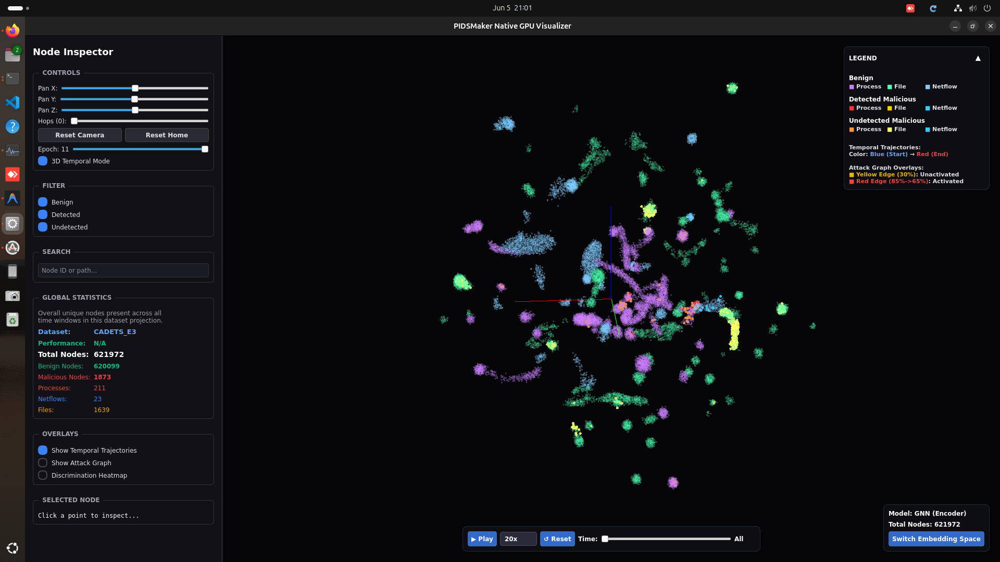

# PIDS Embedding Visualizer

## How it Works

The visualization system consists of three components:

1. **`embedding_viz.py`**
   - Runs automatically at the end of the PIDSMaker pipeline.
   - Extracts Word2Vec and trained GNN Encoder embeddings.
   - Reduces embeddings to 3D spatial coordinates using UMAP.
   - Outputs coordinates and metadata to `.json` files.

2. **`viz_manifest.json`**
   - Generated during the evaluation phase.
   - Stores paths to the `.pth` model weights and evaluation statistics required by the visualizer.

3. **`native_viz.py`**
   - Native desktop GUI.
   - Renders the `.json` output using PyQt5 and VisPy (OpenGL).
   - Features dynamic filtering and swapping between Word2Vec and Encoder embedding spaces.

## Dependencies

The visualization module runs entirely within the Docker container. No host environment setup is required.

Required dependencies (automatically installed in the Docker image):
- **System:** `libgl1-mesa-glx`, `libglib2.0-0`, `libxcb-*`, `libxkbcommon-x11-0`, `libdbus-1-3`, `qtwayland5`
- **Python:** `PyQt5`, `vispy`, `PyOpenGL`, `umap-learn`

## Quickstart / How to Run

### Step 1: Prepare the Host Environment
While the code runs in Docker, the GUI window must render on your host machine's display. You **must** configure your host to accept X11 connections. On your host terminal, run this once per session:
```bash
xhost +local:docker
```
*(If you see `qt.qpa.xcb: could not connect to display` errors, it means this step was skipped).*

### Step 2: Build and Start the Container
From your host machine, build the image (which installs dependencies like PyTorch and RAPIDS) and start the persistent container:
```bash
docker compose -f compose-pidsmaker.yml build pids
docker compose -f compose-pidsmaker.yml up -d
```

### Step 3: Enter the Container
Drop into the running container to execute commands:
```bash
docker exec -it pidsmaker-pids-1 bash
```

### Step 4: Run the Pipeline (Inside Container)
To run the full end-to-end pipeline (featurization -> training -> evaluation -> viz) from scratch:
```bash
python pidsmaker/main.py velox THEIA_E3 --restart_from_scratch
```

If the model is already trained and you only need to re-run the UMAP coordinate generation:
```bash
python pidsmaker/main.py velox THEIA_E3 --force_restart viz
```

### Step 5: Launch Interactive GUI (Inside Container)
Starts the native 3D viewer to explore the generated embeddings:
```bash
python scripts/native_viz.py velox THEIA_E3
```

## Interactive Native GUI



The native visualizer provides a high-performance, interactive 3D environment for exploring provenance graph embeddings. Below is a breakdown of the key features and functionalities available in the interface:

### 1. Node Inspector (Left Panel)
* **Controls:** 
  * Use the **Pan X / Y / Z** sliders to manually translate the camera or use your mouse to rotate and zoom around the 3D projection.
  * **Hops:** Controls the neighborhood depth for context expansion.
  * **Epoch Slider:** For GNN Encoder embeddings, scrub through different training epochs to observe how the embedding space evolves over time.
  * **3D Temporal Mode Toggle:** Switches the layout to visualize embeddings explicitly across a temporal axis.
* **Filter:** Quickly isolate specific node classifications by toggling the visibility of **Benign**, **Detected** (malicious nodes successfully caught by the model), and **Undetected** (malicious nodes missed by the model) points.
* **Search:** Locate specific entities within the massive graph by entering a Node ID or path.
* **Global Statistics:** Displays a high-level summary of the dataset currently loaded, including the total node count, a breakdown of malicious vs. benign nodes, and entity types (Processes, Netflows, Files).
* **Overlays:** 
  * Toggle **Temporal Trajectories** to see how entities behave over time.
  * Toggle the **Show Attack Graph** to overlay edges highlighting the progression of an attack.
  * **Discrimination Heatmap:** Visualizes areas of high anomaly concentration.

### 2. Main 3D Viewport (Center)
This is the UMAP/t-SNE dimensionality reduction of the 128D feature vectors down to 3D space. 
* **Clusters:** Tightly packed groups of nodes indicate high structural/behavioral similarity in the graph. 
* **Interaction:** You can click on any individual point to load its specific metadata into the "Selected Node" box in the bottom left.

### 3. Legend (Top Right)
The legend explains the robust color-coding system designed for forensic analysis:
* **Shapes/Colors by Entity:** Identifies whether a node is a Process, File, or Netflow, and categorizes them into Benign, Detected Malicious, or Undetected Malicious.
* **Temporal Trajectories:** A color gradient from Blue (Start) to Red (End) maps the timeline of events.
* **Attack Graph Overlays:** Shows the activation state of attack edges (e.g., Unactivated vs. Activated thresholds).

### 4. Playback Controls (Bottom)
When analyzing temporal or epoch-based changes, use the timeline controls to auto-play through the sequence. You can adjust playback speed (e.g., 20x) and scrub through time steps manually.

### 5. Embedding Space Switcher (Bottom Right)
Displays the currently loaded model output (e.g., `Model: GNN (Encoder)` or `Word2Vec`). Click **Switch Embedding Space** to hot-swap between the raw structural features (Word2Vec) and the model's learned anomaly features (GNN Encoder) without restarting the application.
