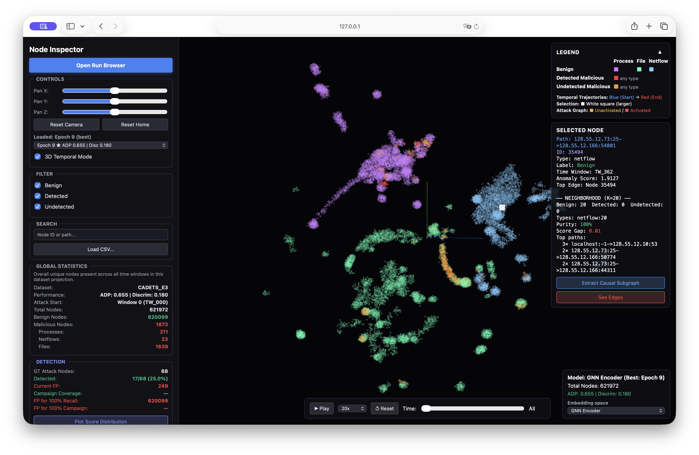

# Embedding Visualizer

PIDSMaker ships an interactive **3D web viewer** for exploring a run's node
embeddings in the browser. A Flask server reads the artifacts a run already
produced and serves a Three.js front end; it is independent of the pipeline —
you generate the data for a run, then open it in the viewer.



It renders the per-node embeddings (UMAP or t-SNE projection) and supports:

- **Temporal playback** — points appear and fade with their time window.
- **Per-node inspection** — click a node for its path, type, label, anomaly score,
  and a K-nearest-neighbour analysis; extract its causal subgraph or incident edges.
- **Two embedding spaces** — switch between the **featurization** space and the
  **GNN encoder** space, with an epoch selector for the encoder.
- **Overlays** — temporal trajectories, the attack graph, a discrimination heatmap,
  and false-positive highlighting.

## Running the viewer

Start the server inside the container:

```shell
python -m pidsmaker.vizgen.web.viz_server
```

Then open `http://127.0.0.1:5000`. The last run you viewed loads automatically; use
**Open Run Browser** (top of the left panel) to pick another. When viewing from
another machine, tunnel over SSH (`ssh -N -L 5000:localhost:5000 <user>@<server>`).

!!! tip
    If `localhost` is refused but `127.0.0.1` works, the server is bound to IPv4
    only (`--host 0.0.0.0`) while `localhost` resolves to IPv6; start it with
    `--host ::` to serve both.

## Generating viz data for a run

A run needs an embedding export before it can be opened. The easiest path is the
in-browser **Run Browser → Generate** button; you can also generate from the CLI:

```shell
python -m pidsmaker.vizgen.web.export SYSTEM DATASET --embeddings both
```

### Opt in when training: `--save_for_viz`

Generation is fastest and most complete when the training run **pre-saved** the
extra artifacts the exporter reuses — the per-epoch model checkpoints (for the
GNN-encoder space and epoch selector) and a cached copy of the test graphs. These
are large and most runs never open the viewer, so they are **off by default** and
enabled per run:

```shell
python pidsmaker/main.py SYSTEM DATASET --save_for_viz
```

Enable it on the runs you intend to explore. Without it, a run is still
discoverable and you can still generate viz data, but the **featurization** space
works normally while the **GNN encoder** space needs the checkpoints (skipped with
a warning if absent), and the test graphs are recomputed on demand.

## More details

The web viewer has its own README covering the run browser, generation options,
buffer/streaming design, and endpoints:
[`pidsmaker/vizgen/web/README.md`](https://github.com/ubc-provenance/PIDSMaker/blob/main/pidsmaker/vizgen/web/README.md).
