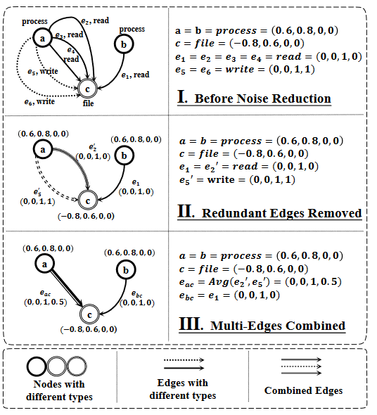
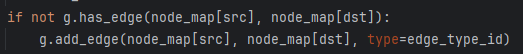
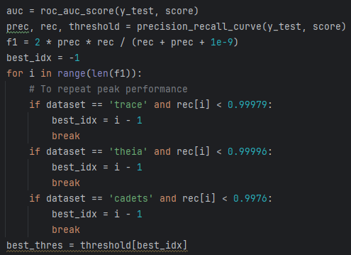

# MAGIC

## Differences between paper and codes
1. In their paper, an edge fusion method is described. First one of
each type of edges is remained and then multi-label hashing is applied
to transfer each remaining edge to a label tuple. Then multiple edges between
two nodes are merged into one edge whose label is computed based on all remaining
edges. 
The process is like following fig

However in their code, only the first edge between two nodes is actually preserved
(rather than one edge per type). And the edge label directly uses the one-hot edge type, 
and does not implement multi-label hashing. Their code of add edges is in following fig

2. They said they can conduct a batch-level detection first and then run entity-level detection
in abnormal batches. But in their code, the batch-level detection is not actually used in
their code.

3. Although their method is an unsupervised detection method, the selection of their 
detection threshold uses ground truth. In fact, they choose the best threshold based
on the embeddings of all test set nodes and ground truth.

Here, `y_test` is ground truth and `score` is node embeddings. They select a threshold with 
high F1 score and then use it to get a high detection performance.