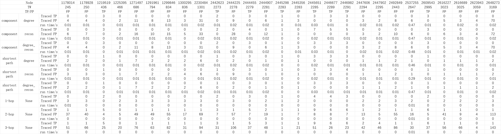

# Results of Triage 07-18

- `tracing method` is by what means we extract components from poi
  1. `component` means we use the original method of DEPIMPACT. 1) converting 
  graphs to DAG; 2) conduct backward tracing from poi and forward tracing from 
  entries to generate dependency graphs seperately; 3) the intersection of backward
  and forward dependency graphs are extracted as components.
  2. `shortest_path` means we only extract the shortest path between entries and poi
  as components.
- `score` is the socre used to identify critical component
  1. `degree` refers to score based on node degree distribution which indicates
  how nodes in the components concentrate on poi (one of the three metrics used by
  DEPIMPACT)
  2. `recon` refers to the score based on reconstruction error which indicates
  how abnormal nodes are
  3. `degree_recon` refers to the hybrid score which is the normalized sum of
  the two scores above
- `run time` refers to the time consumption of triage 

## Result on CADETS_E3
- `time_window_size = 1.0` (1 min graphs)
- `ground_truth_version = darpa_v4` (using new ground truth)

| tracing method | score        | TP | FP   | TN     | FN  | run time |
|----------------|--------------|----|------|--------|-----|----------|
| component      | degere       | 20 | 190  | 559685 | 212 | 4s       |
| component      | recon        | 23 | 217  | 559658 | 209 | 5s       |
| component      | degree_recon | 20 | 190  | 559685 | 212 | 4s       |
| shortest_path  | degree       | 16 | 38   | 559837 | 216 | 5s       |
| shortest_path  | recon        | 16 | 50   | 559825 | 216 | 4s       |
| shortest_path  | degree_recon | 16 | 38   | 559837 | 216 | 5s       |
| before triage  | None         | 8  | 19   | 559856 | 224 | -        |
| 1-hop          | None         | 16 | 46   | 559829 | 216 | 1s       |
| 2-hop          | None         | 38 | 684  | 559191 | 194 | 1s       |
| 3-hop          | None         | 38 | 1037 | 558838 | 194 | 1s       |

Generally, using `component` means more TPs and FPs. That is because when we 
identify the same entry as critical entry, `component` method extracts all 
paths between it and poi and `shortest_path` method extracts only one of paths.

## Result on THEIA_E3
- `time_window_size = 1.0` (1 min graphs)
- `ground_truth_version = darpa_v4` (using new ground truth)

| tracing method  | score        | TP | FP    | TN      | FN  | run time |
|-----------------|--------------|----|-------|---------|-----|----------|
| component       | degere       | 20 | 267   | 1501128 | 218 | 5min     |
| component       | recon        | 32 | 38175 | 1463220 | 206 | 5min     |
| component       | degree_recon | 20 | 267   | 1501128 | 218 | 5min     |
| shortest_path   | degree       | 14 | 14    | 1501381 | 224 | 12min    |
| shortest_path   | recon        | 14 | 7794  | 1493601 | 224 | 12min    |
| shortest_path   | degree_recon | 14 | 14    | 1501381 | 224 | 12min    |
| before triage   | None         | 5  | 6     | 1501389 | 233 | -        |

On THEIA_E3 we can see `component` method is faster.

And I noted that using `recon` score leads to much more FPs. So I checked the 
log.
This is due to the fact that the dependency graphs of some FP POIs contain some 
nodes with relatively large reconstruction errors. Selecting critical components 
using only reconstruction error scores leads to a relatively large component.

```angular2html
41 2024-07-18 02:50:41 - POI 959373 in time window 1260 is a FP POI
42 2024-07-18 02:50:41 - Tracing poi 959373 in time window 1260 leads to:
43 2024-07-18 02:50:41 - TPS: 0, FPS: 37837
```
```
41 2024-07-18 02:43:12 - POI 959373 in time window 1260 is a FP POI
42 2024-07-18 02:43:12 - Tracing poi 959373 in time window 1260 leads to:
43 2024-07-18 02:43:12 - TPS: 0, FPS: 7783
```

## Detailed tracing info on CADETS_E3

The following fig show all poi nodes, which time window they belongs to and whether they are
TP or FP nodes. 
And how many TPs and FPs can be traced starting from these poi nodes and the time consumption.


